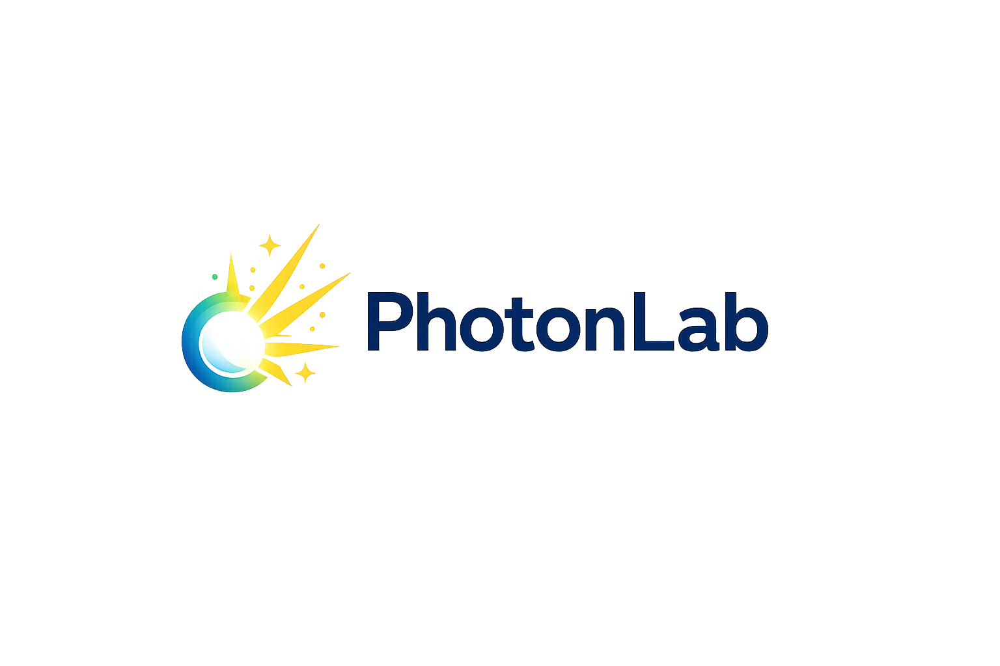
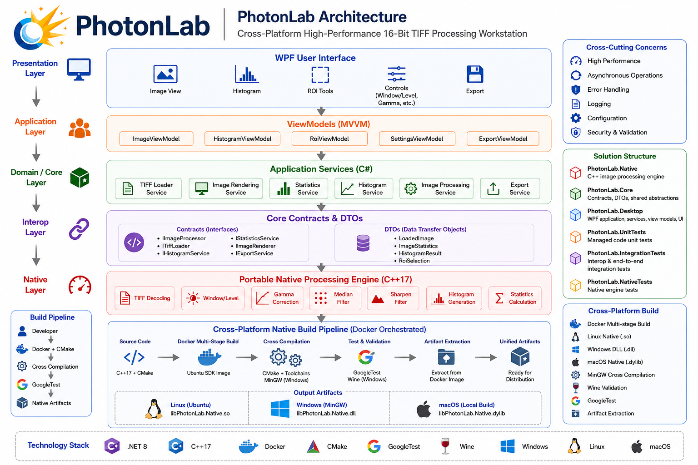

# PhotonLab

<p align="center">
  
</p>

<p align="center">
  <em>A high-performance workstation for professional 16-bit TIFF image visualization, analysis, and processing.</em>
</p>


---


---


---

## Table of Contents

* [1. Features](#features)
  * [Image Visualization](#image-visualization)
  * [Image Processing](#image-processing)
  * [Architecture Features](#architecture-features)
  * [Analysis and Diagnostics](analysis-and-diagnostics)
* [2. Cross Platform Native Build](#cross-platform-native-build)
* [3. Solution Structure](#solution-structure)
  * [Components](#components)
* [4. Architecture](#architecture)
* [5. Image Processing Pipeline](#image-processing-pipeline)
* [6. Build Requirements](#build-requirements)
  * [Development Environment](#development-environment)
  * [Native Dependencies](#native-dependencies)
* [7. Testing](#testing)
  * [Unit Tests](#unit-tests)
  * [Integration Tests](#integration-tests)
  * [Native Tests](#native-tests)
* [8. Native Integration](#native-integration)
* [9. Future Enhancements](#future-enhancements)
* [10. License](#license)

---

## System Architecture Overview

The following diagram illustrates the strict downward dependency flow within PhotonLab, ensuring a responsive UI and high-performance image processing:

<p align="center">
  
</p>

---

## High-Performance 16-Bit TIFF Review and Processing Workstation

PhotonLab is a desktop imaging application designed for viewing, analyzing, and processing 16-bit TIFF images. The platform combines a modern WPF user interface, a managed C# service layer, and a high-performance native C++ processing engine to deliver responsive visualization and advanced image analysis capabilities.

---

## Features

### Image Visualization

- 16-bit TIFF image support
- Window/Level based visualization
- Real-time zoom and fit-to-screen
- Pixel-level inspection (cursor tracking)
- Metadata display (dimensions, bit depth, format)

### Image Processing

- Gamma correction
- Median filtering
- Sharpening filter
- Window/Level transformation
- Native high-performance processing pipeline

### Analysis and Diagnostics

- Real-time histogram generation
- Statistical analysis (min, max, mean, median, std dev)
- Normalized histogram scaling (log-based)
- Session-based image state management

### Export Capabilities

- PNG export
- JPEG export
- TIFF export
- Session-aware rendering export

### Architecture Features

- MVVM-based WPF architecture
- Dependency injection friendly design
- Async processing pipeline (non-blocking UI)
- Managed → Native interop layer
- OpenTelemetry tracing integration
- Structured logging (ILogger)


---

## Cross Platform Native Build

PhotonLab includes a fully automated Docker-based native build pipeline.

```
Developer
      │
      ▼
Docker Multi-stage Build
      │
      ├───────────────► Linux (.so)
      │
      ├───────────────► Windows (.dll via MinGW)
      │
      └───────────────► macOS (.dylib local build)
      │
      ▼
GoogleTest Validation
      │
      ▼
Artifact Extraction
      │
      ▼
Unified Distribution
```

## Solution Structure

```text
PhotonLab/
├── PhotonLab.Native
├── PhotonLab.Core
├── PhotonLab.Desktop
├── PhotonLab.UnitTests
├── PhotonLab.IntegrationTests
└── PhotonLab.NativeTests
```

### Components

| Project                    | Responsibility                                       |
| -------------------------- | ---------------------------------------------------- |
| PhotonLab.Native           | Native C++ image processing engine                   |
| PhotonLab.Core             | Contracts, DTOs, shared abstractions                 |
| PhotonLab.Desktop          | WPF application, ViewModels, services, UI            |
| PhotonLab.UnitTests        | Managed component unit tests                         |
| PhotonLab.IntegrationTests | Native interop and end-to-end integration validation |
| PhotonLab.NativeTests      | Native processing engine validation                  |

---

## Architecture

PhotonLab follows a layered architecture based on MVVM principles and strict separation of concerns.

```text
┌──────────────────────────────┐
│           WPF UI             │
└──────────────┬───────────────┘
               │
               ▼
┌──────────────────────────────┐
│         ViewModels           │
└──────────────┬───────────────┘
               │
               ▼
┌──────────────────────────────┐
│     Application Services     │
│  Rendering / Statistics /    │
│  Histogram / Export / TIFF   │
└──────────────┬───────────────┘
               │
               ▼
┌──────────────────────────────┐
│      Core Contracts & DTOs   │
└──────────────┬───────────────┘
               │
               ▼
┌──────────────────────────────┐
│      Native Interop Layer    │
└──────────────┬───────────────┘
               │
               ▼
┌──────────────────────────────┐
│   Native C++ Processing      │
└──────────────────────────────┘
```

Additional architecture documentation is available in:

```text
Docs/
└── Architecture/
    ├── Overview.md
    ├── HighLevelArchitecture.md
    ├── ProcessingPipeline.md
    └── NativeInterop.md
```

---

## Image Processing Pipeline

PhotonLab processes images through a session-based pipeline:

- Load TIFF via ITiffLoader
- Initialize session via IImageSessionService
- Process pixels via IImageProcessingService
- Render BGRA32 display buffer via IImageRenderer
- Update WPF BitmapSource
- Refresh statistics and histogram asynchronously

---

## Build Requirements

### Development Environment

* Visual Studio 2022
* .NET 8 SDK
* C++17 Compiler
* Windows 10/11 SDK

### Native Dependencies

* CMake 3.25+
* MSVC Toolchain
* Native TIFF processing libraries (if applicable)

---

## Testing

PhotonLab includes multiple testing layers.

### Unit Tests

```text
PhotonLab.UnitTests
```

Coverage includes:

* Services
* DTO validation
* Processing workflows
* Histogram generation
* Statistics calculations

### Integration Tests

```text
PhotonLab.IntegrationTests
```

Coverage includes:

* Native interop validation
* TIFF loading workflow
* Managed-to-native communication
* End-to-end processing pipelines

### Native Tests

```text
PhotonLab.NativeTests
```

Coverage includes:

* Gamma correction
* Median filtering
* Sharpen filtering
* Histogram generation
* Window/Level processing

---

## Native Integration

PhotonLab uses a managed-to-native architecture:

```text
C# UI
  ↓
Service Layer
  ↓
Contracts
  ↓
P/Invoke Interop
  ↓
Native C++ Engine
```

This approach enables a responsive user experience while leveraging native performance for computationally intensive image operations.

---

## Future Enhancements

* CLAHE enhancement
* SIMD optimization
* GPU acceleration
* DICOM support
* Multi-image comparison
* Tile-based processing
* Multi-threaded rendering pipeline

---

## License

Licensed under the Apache License, Version 2.0.

See LICENSE for details.
